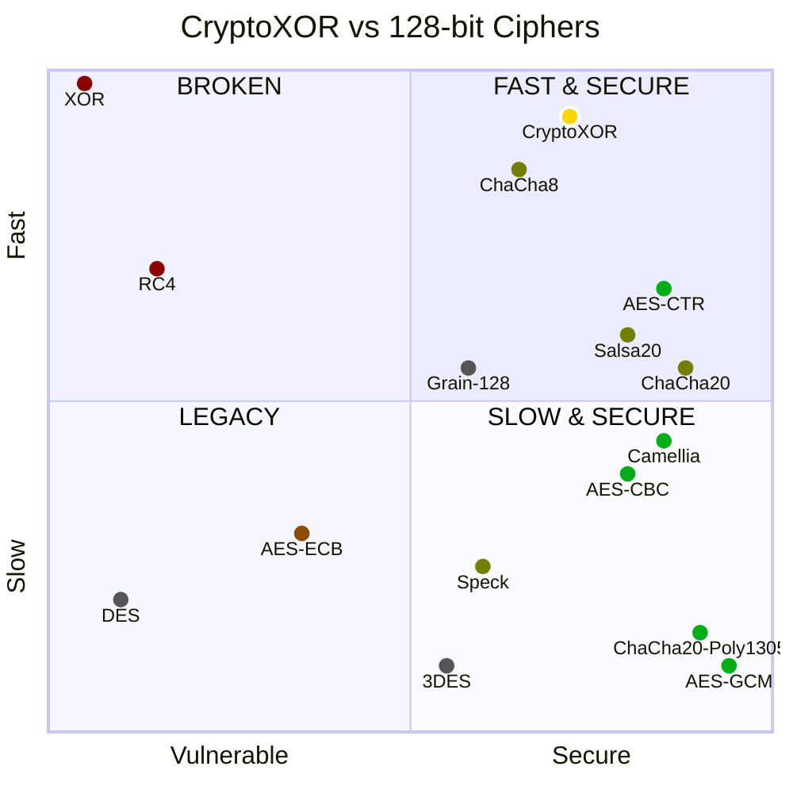

```mermaid
quadrantChart
	title CryptoXOR vs 128-bit Ciphers
	x-axis Vulnerable --> Secure
	y-axis Slow --> Fast

	quadrant-1 "FAST & SECURE"
	quadrant-2 "BROKEN"
	quadrant-3 "LEGACY"
	quadrant-4 "SLOW & SECURE"

%% --- HERO POINT: CryptoXOR ---
%% Highlighted with Gold color, extra size, and border
	"CryptoXOR": [0.72, 0.93] radius: 6, color: #FFD700, stroke-color: #FFFFFF, stroke-width: 2px

%% --- Q1: The Golden Zone (Competitors) ---
"Speck": [0.60, 0.25] color: #747f00
"ChaCha8": [0.65, 0.85] color: #747f00
"Salsa20": [0.80, 0.60] color: #747f00
"ChaCha20": [0.88, 0.55] color: #747f00

%% --- Q2: Broken Toys ---
"XOR": [0.05, 0.98] color: #8B0000
"RC4": [0.15, 0.70] color: #8B0000
"DES": [0.1, 0.2] color: #555555

%% --- Q3: Legacy/Mode Failures ---
"AES-ECB": [0.35, 0.30] color: #8e4c00
"3DES": [0.55, 0.1] color: #555555
"Grain-128": [0.58, 0.55] color: #555555

%% --- Q4: The Heavy Standards ---
"AES-CTR": [0.85, 0.67] color: #01ad17
"AES-CBC": [0.8, 0.39] color: #01ad17
"Camellia": [0.85, 0.44] color: #01ad17
"ChaCha20-Poly1305": [0.90, 0.15] color: #01ad17
"AES-GCM": [0.94, 0.10] color: #01ad17


```